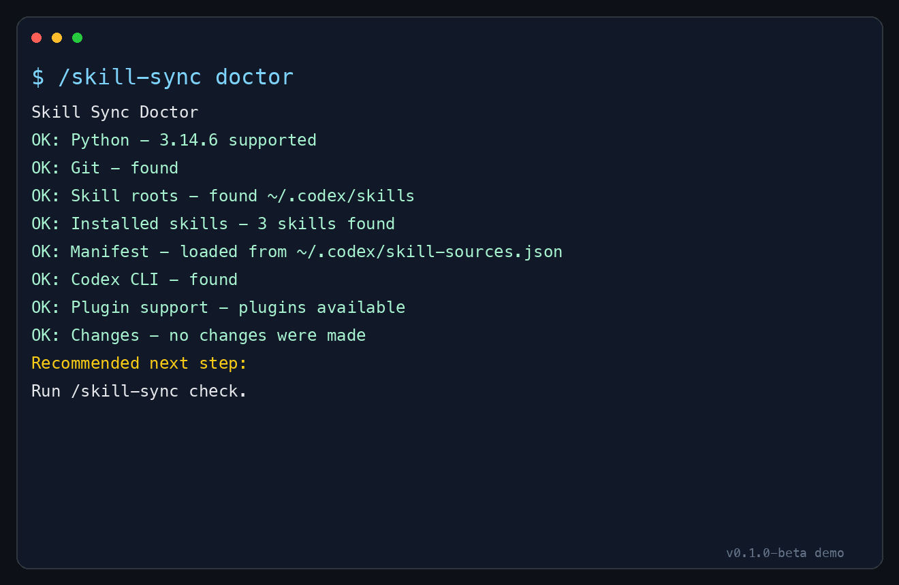

# Skill Sync

语言：[English](README.md) | [简体中文](README.zh-CN.md)

[](https://github.com/catalystsystemslab/codex-skill-sync/actions/workflows/ci.yml)

安全地让你的 Codex 技能保持最新。

## 从这里开始

把这段话粘贴给 Codex：

```text
Install Skill Sync from https://github.com/catalystsystemslab/codex-skill-sync
Then run /skill-sync doctor
```

在你确认之前，Skill Sync 不会更新任何内容。

## 演示

终端输出：



## 要求

- Python 3.9+
- Git
- 只有在你需要更新 Codex 插件时才需要 Codex CLI

## CI 已验证

每次推送都会运行：

- Python 编译检查
- 内置自测
- `doctor` 文本模式
- `doctor` JSON 模式
- 友好的缺失 manifest 失败检查

## 参与贡献和 Beta 反馈

Skill Sync 目前处于公开 Beta。欢迎通过 GitHub issues 和 pull requests 提供反馈或贡献。

- Beta 测试清单：[docs/TESTING.md](docs/TESTING.md) / [中文](docs/zh-CN/TESTING.md)
- 反馈指南：[docs/FEEDBACK.md](docs/FEEDBACK.md) / [中文](docs/zh-CN/FEEDBACK.md)
- 贡献指南：[CONTRIBUTING.md](CONTRIBUTING.md)
- 安全政策：[SECURITY.md](SECURITY.md)

如果你想提出较大的运行时行为改动，请先开 issue 讨论，尤其是和应用更新、来源映射、恢复流程、远程仓库处理有关的改动。

## Skill Sync 永远不会做什么

- 不会更新未知来源的技能。
- 不会猜测 GitHub 仓库。
- 不会替换私有或本地技能，除非你明确映射它们。
- 不会在 `check` 过程中应用更改。
- 不会更新符号链接安装的技能目录。
- 替换技能前会先创建备份。

## 它能做什么

- 将已安装的技能和插件列为官方、社区或需要设置。
- 将确认过的技能到 GitHub 来源映射保存到 `~/.codex/skill-sources.json`。
- 更新已映射的 GitHub-backed 技能。
- 刷新已安装的 Codex 插件。
- 替换技能前先备份。
- 跳过未知、私有或本地技能，直到你映射或标记它们。

## 三种状态分组

- 官方：由 OpenAI 或官方来源维护。
- 社区：有确认过的公开来源，但不是官方维护。
- 需要设置：Skill Sync 还不知道这个技能来自哪里，所以不会更新它。

## 安全更新流程

1. 检查已安装内容。
2. 只映射确认过的公开技能。
3. 先预览更新。
4. 确认后再应用。
5. 如有需要，从备份恢复。

## 安装

克隆这个仓库，然后把技能目录复制到你的 agent 技能目录。

### Codex

```bash
mkdir -p ~/.codex/skills
cp -R skill-sync ~/.codex/skills/
```

### Claude Code

```bash
mkdir -p ~/.claude/skills
cp -R skill-sync ~/.claude/skills/
```

### Cursor

```bash
mkdir -p ~/.cursor/skills
cp -R skill-sync ~/.cursor/skills/
```

## 使用方式

在 Codex 中输入其中一个命令：

```text
/skill-sync doctor
/skill-sync check
/skill-sync update
/skill-sync run all
```

会发生什么：

1. `doctor` 检查本地环境是否准备好，不做任何修改。
2. `check` 列出已安装的技能和插件。
3. 它会把技能分成官方、社区和需要设置。
4. 如果有缺失来源的技能，它会询问你是否现在映射 GitHub 仓库，或这次先跳过。
5. `check` 只做预览，不会应用更改；`update` 和 `run all` 会在应用前请求确认。
6. 成功更新后，它可以帮助你创建每周检查自动化。

## 你会看到什么

每个命令都会输出清晰摘要，让你知道发生了什么，而不是一堆难懂日志。

`/skill-sync doctor` 会先检查环境：

```text
Skill Sync Doctor
OK: Python - 3.11.8 supported
OK: Git - found
Recommended next step:
Run /skill-sync check.
```

`/skill-sync check` 会列出技能并预览可更新项，不会修改任何内容：

```text
Skill Sync Check
No changes were made. This was a preview.
Skills with updates available:
- my-skill
Recommended next step:
Run /skill-sync update if you want to apply the available skill updates.
```

`/skill-sync update` 会在你确认后应用更新：

```text
Skill Sync Update
Changes were made.
Updated skills:
- my-skill
  Backup: ~/.codex/skills/.skill-sync-backups/my-skill-...
Recommended next step:
Run /skill-sync check to verify everything is current.
```

## 高级：直接使用 CLI

直接运行清单检查：

```bash
python3 skill-sync/scripts/update_codex_assets.py --inventory --json
```

运行只读诊断：

```bash
python3 skill-sync/scripts/update_codex_assets.py --doctor
```

预览更新，不应用：

```bash
python3 skill-sync/scripts/update_codex_assets.py --json
```

应用更新：

```bash
python3 skill-sync/scripts/update_codex_assets.py \
  --apply \
  --json
```

只刷新 Codex 插件：

```bash
python3 skill-sync/scripts/update_codex_assets.py \
  --plugins-only \
  --apply \
  --json
```

运行 smoke test：

```bash
python3 skill-sync/scripts/update_codex_assets.py --self-test
```

在 Codex 之外使用时，可以跳过插件处理：

```bash
python3 skill-sync/scripts/update_codex_assets.py --inventory --no-plugins
python3 skill-sync/scripts/update_codex_assets.py --apply --no-plugins
```

## 来源清单

确认过的映射默认保存到 `~/.codex/skill-sources.json`。你也可以通过 `--manifest` 指定其他清单。

Manifest 搜索顺序：

1. `--manifest <path>`
2. `~/.codex/skill-sources.json`
3. `./skill-sources.json`
4. `./skills-sources.json`

只映射你能确认的仓库。如果找不到仓库，就留空。只有当用户说明技能是私有或仅本地使用时，才把它标记为本地。

映射公开技能时，先搜索上游公开仓库。不要猜测 `catalystsystemslab/<skill>` 或其他用户/组织镜像，除非技能本身写明该仓库，或用户确认。

选择 Map 意味着可以进行公开 GitHub/web 搜索；只有在网络被阻止或匹配不确定时才再次询问。

技能作者可以在 `SKILL.md` 顶部附近添加来源行，让复制安装也能被发现：

```text
Source: https://github.com/<owner>/<repo>/tree/<branch>/<skill-subpath>
```

Manifest 示例：

```json
{
  "skill_roots": [
    "~/.codex/skills",
    "~/.claude/skills"
  ],
  "skills": [
    {
      "name": "accessibility",
      "root": "~/.codex/skills",
      "url": "https://github.com/addyosmani/web-quality-skills",
      "branch": "main",
      "subpath": "skills/accessibility"
    },
    {
      "name": "my-private-skill",
      "root": "~/.codex/skills",
      "kind": "local"
    }
  ],
  "plugins": [
    {
      "id": "github",
      "marketplace": "openai-curated"
    }
  ]
}
```

完整模板见 [`skill-sync/references/manifest.example.json`](skill-sync/references/manifest.example.json)。

## 安全模型

- 默认模式是 dry-run：只预览，不修改。
- 必须使用 `--apply` 才会修改文件系统或插件。
- 每次替换技能前，都会在技能根目录下的 `.skill-sync-backups/` 中创建带时间戳的备份。
- Apply 会拒绝替换配置技能目录之外的路径。
- Apply 会拒绝替换符号链接安装的技能。请直接更新符号链接指向的源仓库。
- 安装前会检查远程技能目录。
- 不安全的符号链接、断开的符号链接、过大的技能目录、逃逸 subpath 都会被拒绝。
- 未知技能只会被报告，不会被覆盖。
- 标记为 `"kind": "local"` 的本地技能总是会被跳过。
- 脚本会替换整个技能目录，不会合并本地修改。如果你有本地编辑需要保留，不要直接用它更新。

## 从备份恢复

如果更新后出现问题，问 Codex：

```text
/skill-sync help me restore my-skill from the latest backup
```

Skill Sync 的备份位置：

```text
~/.codex/skills/.skill-sync-backups/
```

高级手动恢复：

```bash
mv ~/.codex/skills/my-skill \
  ~/.codex/skills/my-skill.broken-$(date +%Y%m%d-%H%M%S)
cp -R ~/.codex/skills/.skill-sync-backups/<backup-folder> \
  ~/.codex/skills/my-skill
```

## Codex 插件更新

当使用 `--apply` 且插件在范围内时，脚本会运行：

```bash
codex plugin marketplace upgrade --json
codex plugin list --json
codex plugin add <plugin>@<marketplace> --json
```

如果 `codex plugin list --json` 不可用，它会退回到文本解析 `plugin@marketplace` 格式。

插件更新只适用于 Codex。Claude Code 和 Cursor 用户仍然可以使用技能更新功能。

## 开发者说明

仓库结构：

```text
.
|-- README.md
`-- skill-sync/
    |-- SKILL.md
    |-- agents/
    |   `-- openai.yaml
    |-- references/
    |   `-- manifest.example.json
    `-- scripts/
        `-- update_codex_assets.py
```

可安装的技能是 `skill-sync/` 目录。

开发时可以使用符号链接而不是复制：

```bash
ln -s "$PWD/skill-sync" ~/.codex/skills/skill-sync
```

符号链接安装是给开发者用的。Skill Sync 不会自动替换符号链接技能；请直接更新源仓库。

发布前：

- 运行 `python3 skill-sync/scripts/update_codex_assets.py --self-test`
- 运行 `python3 -m compileall skill-sync/scripts/update_codex_assets.py`
- 运行 `python3 skill-sync/scripts/update_codex_assets.py --doctor`
- 确认 GitHub Actions 是绿色。

## 限制

- 支持 GitHub 和普通 Git clone URL。不支持 package registry。
- 不会合并本地修改；脚本会备份然后替换。
- 插件更新需要 Codex CLI。
- 来源发现是保守的。复制来的 monorepo 子目录通常需要 manifest。
- 默认拒绝非常大的技能目录。
- 如果 GitHub `/tree/<branch>/<subpath>` URL 的 branch 名包含 `/`，解析会有歧义；这种情况请在 manifest 中显式使用 `branch` 和 `subpath` 字段。

## 许可证

MIT。见 [LICENSE.md](LICENSE.md)。
